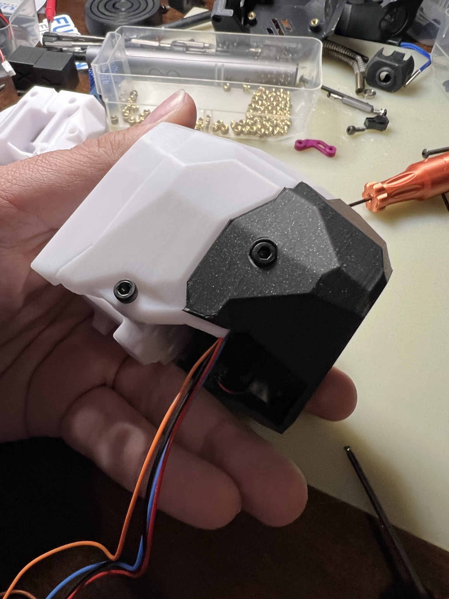

## CB-C2 (Can Bus for Clockwork 2)

This is a mount for CW2 with a cover to protect from the Z-Chain on the 2.4, Trident and Switchwire

---------------------------------------------------------------------------------------

Note: This has not been tested all wired up just yet (AKA and work in progress) Things are subject to change until the offical release

---------------------------------------------------------------------------------------

Note2: Also all testing has been done on only the wire glands listed in the BOM below.. If you use another, use it at your own risk of it not fitting

 
---------------------------------------------------------------------------------------

Features 
- Rear mounted with an opening door for easy access to the wirings
- Active cooling
- Protection against the Z chain on X movements
- Umbilical 

---------------------------------------------------------------------------------------

!!!Coming soon: Klipper config

---------------------------------------------------------------------------------------

RC2:

- reworked the locking screw solution on the Door by offering a modified cable door for CW2.
	- This should option up more room for cables
	- This should fix issues with the right side not closing all the way
	- improved look and integration with CW2 was achieved with this as well
- Optional Sealing Nut for the cable gland is included
	- This should help if you are less worried about the extra strain relief and more worried about Z height
	- This should fix issues with the strain relief hitting the Top left bolt on the Switchwire

RC1.1:
 - Added a bit more space for the fan (it was too tight lol)

RC1: 

Change log:
- Complete redraw
- Rotated the board in the door (this was needed to allow DuPont connectors to have clearance)
- Validated Cable clearance for Dupont connectors and heaters 
- Moved the fan for better airflow over the whole board
- improved printability 
- Pivot of hinge is improved for more clearance
- validated a full travel on the X without hitting the mount
- Back is now only 0.019mm deeper than the X extrusion
- Mount is now compatible with version 1.1 boards

Beta 2 - 7/16/22
- Shaved 2mm off the back
- Shaved lower left edge due to concerns with hiting bolts on a full movement of the x carage. 
- Simplified design by removing the spacer
- improved printability 
	
	

---------------------------------------------------------------------------------------

BOM:

Kit avaialbe from DFH https://deepfriedhero.in/products/cb-c2-can-bus-for-clockwork-2-kit-by-kejar31?_pos=1&_psq=cb&_ss=e&_v=1.0

- 1 X EBB36 (https://deepfriedhero.in/products/ebb36)
- 1 X M12 Cable Gland (https://deepfriedhero.in/products/m12-nylon-cable-gland)
- 1 X Sunon 2010 5v fan to be used on the bltouch probe pin Can be purcheased from multiple vendoers but can also be had from the DFH kit.. 
    - Note: this is the same fan that comes with the Revo micro
- 5 X M3 Threaded Insert (5x4)
- 1 X M3x25 SHCS
- 1 X M3x16 SHCS
- 4 X M3x6 SHCS

---------------------------------------------------------------------------------------

Install: (wireing nore software configureation are included)

install instrutions for RC1 comeing soon

 
 
 
 
 

