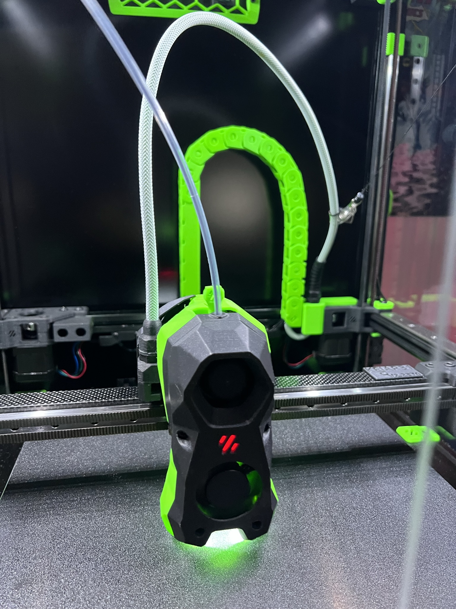
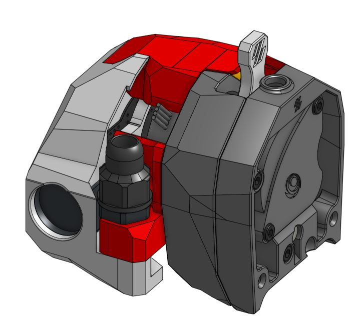
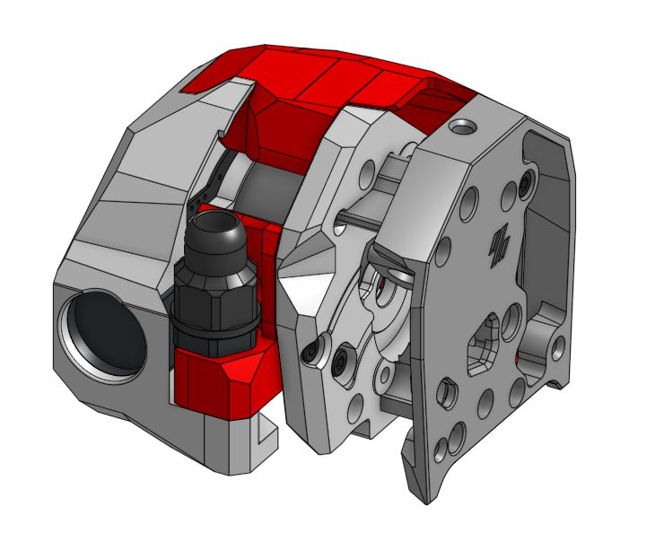
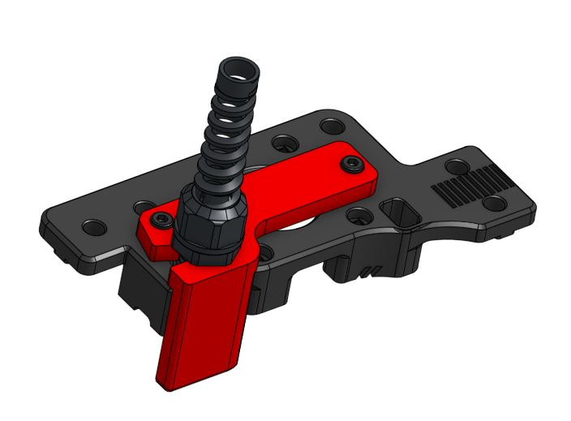
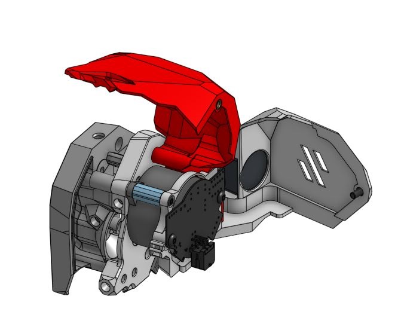

## CB-C2 V2 (Can Bus for Clockwork 2)

This is a mount for CW2 and CW2 style mounts with a cover to protect from the Z-Chain on the 2.4 and Trident

---------------------------------------------------------------------------------------
 

---------------------------------------------------------------------------------------

Note 1: All testing has been done on only the wire glands from DFH I can not guarentee they will work with other PG7 glands..

Note 2: The LGX lite version of this was designed around Eytecz LGX Lite Stealthburner CW2 style mount which is awesome.. It is reconemded you check that out yourself

Note 3: The rear umbilical mount is a modified version of Hartk1213.. the only change I had to make was addina slit to the side to allow the realease of cables. all --credit for that mounts design should go to him

---------------------------------------------------------------------------------------

Features 
- Rear door to help ensure you dont snad your cables on the Z chain or otherwise
- Active cooling
- Umbilical system

--------------------------------------------------------------------------------------

BOM:

The BOM should be included in the assembly manuals other than the rear umbiliical for CW2

That BOM requires 
1x PG7 cable gland (from DFH he has them listed as M12 cable glands.
2x M3x8 SHCS screwsd

Kit avaialbe from DFH coming soon hopefully

---------------------------------------------------------------------------------------

Here are some images to help you understand what this is

 
 
 
 

