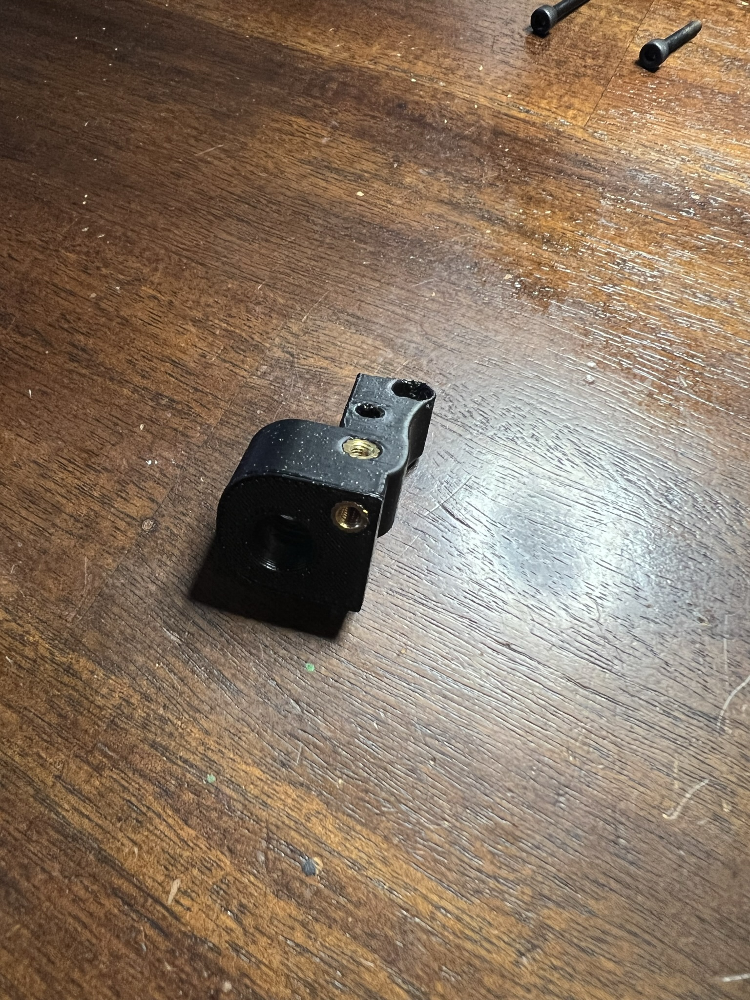
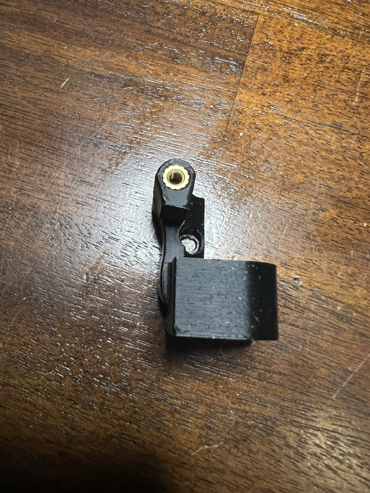

## CB-C2 (Can Bus for Clockwork 2)

This is a mount for CW2 with a cover to protect from the Z-Chain on the 2.4 and Trident (should work for Switchwire as well)

Note: This is a Beta and has not been tested with it being wired up etc just yet (AKA and work in progress) Things are subject to change

!!!Coming soon: Klipper config

Install instructions (wiring not included)

BOM:

- 1 X EBB36 (https://deepfriedhero.in/products/ebb36)
-  1 X M12 Cable Gland (https://deepfriedhero.in/products/m12-nylon-cable-gland)
- 1 X Sunon 2010 5v fan to be used on the bltouch probe pin (https://www.digikey.com/en/products/detail/sunon-fans/MF20100V1-1000U-A99/10441397)
    - Note: this is the same fan that comes with the Revo micro
- 6 X M3 Threaded Insert (5x4)
- 1 X M3x25 SHCS
- 1 X M3x16 SHCS
- 1 X M3x12 SHCS
- 4 X M3x6 SHCS

Install

Note:
	It is important to make sure all of your threaded inserts are strait or you will have issues

1. Add a threaded insert to each side of the spacer
2. Add the two threaded inserts to the Cable Gland Mount (see pic below)
3. Attach  the spacer to the Cable Gland Mount using a M3x2 SHCS screw. This must be done before the next step.. Also be sure to check your orientation, the indented side goes toward the motor and away from the cable gland. (see pic below) 
4. Attach the Cable Gland Mount to CW2 Cable chain mounts using 2 X M3x6 SHCS screws, anything longer will not allow the Cable Gland to be threaded in. (see pic below)
5. Remove the bottom nut from the M12 Cable Gland and put it aside, as it will no longer be needed. 
6. Insert the Cable Gland into the mount using the threads (see pic below)
7. Add the two threaded inserts to the Mount where the Board on the standoffs
8. Insert the 2010 Fan, this is press fitted only and is made purposely to be a very tight fit. Be sure to orientate the wire off the fan to the left back side.. (see the pic below)
9. Install the Board to the Mount using 2 X M3x6 SHCS screws (see pic below)
10. Install the Mount to the threaded insert at the bottom of the Cable Gland Mount using a M3x16 SHCS, don't over tighten and be sure the check that the mount opens about 90 degrees (see pic below)
11. Insert a 1 X M3x25 SHCS in the rear of the mount to complete the install

