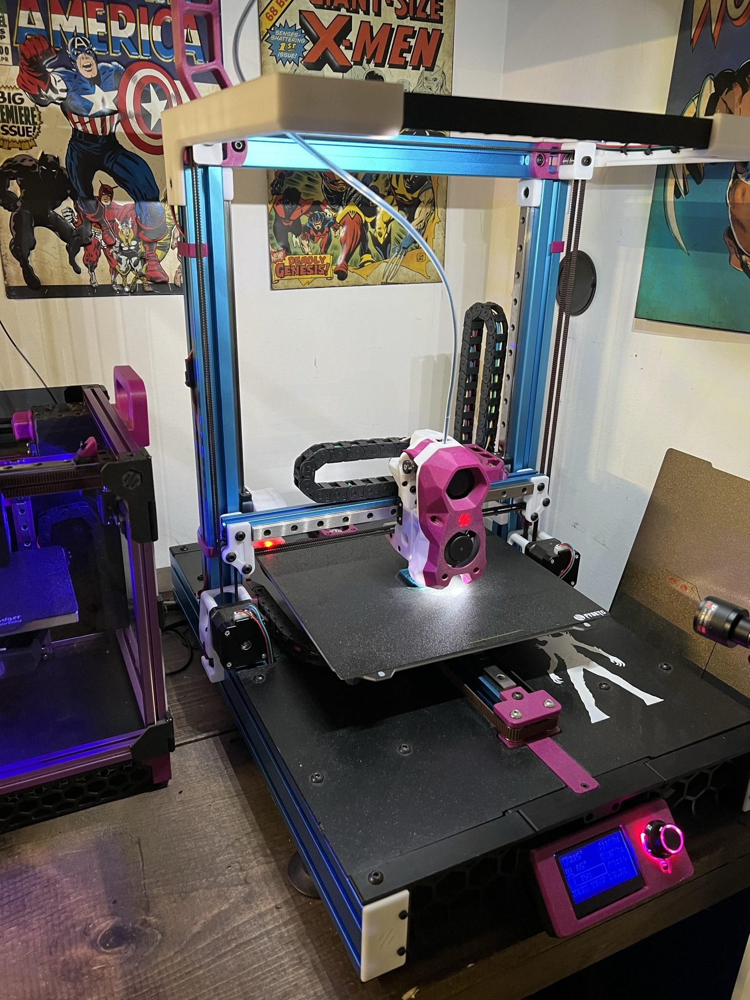
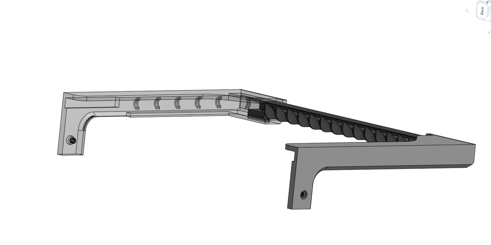

## Geordi LightBar for Switchwire

 

---------------------------------------------------------------------------------------

A remix / redraw of the great design  by KenadyDwag44 https://github.com/VoronDesign/VoronUsers/tree/master/printer_mods/KenadyDwag44/sw_lightbar

The goal here is to add a light bar to SwitchWire in a non-encloused build

The changes include 

1. Wire management is now handles by tie wraps with loops built into the frame 
2. Designed with  NeoPixel's in mind, both sides of the lightbar are open for including cables routes with larger wire openings around the extrusion (to account for 3 cable led harnesses)
3. Stronger design.. The lightbar now press fits into the mounts with heated inserts to tighten them together fully.

All this and the prints still fit onto the standard SwitchWire bed.   

---------------------------------------------------------------------------------------

Klipper config

If you are running stealth burner with neopixels its easy enough to just slight modify the config to include the extra lights (be sure to wire them inline with the stealthburner, making the stealthburner the last there in the path)

in Stealthburner.cfg change the following

from:	chain_count:3
to: 	chain_count:10

from:	variable_logo_idx: "1" 
to:		variable_logo_idx: "8" 

from:	variable_nozzle_idx: "2,3"
to:		variable_nozzle_idx:  "1,2,3,4,5,6,7,9,10"

---------------------------------------------------------------------------------------

BOM:

- 2 X M3 Threaded Insert (5x4)
- 2 X M3x10 SHCS 
- 2 X M5x10 BHCS
- 2 X M5 T-Nut (For 3030)

---------------------------------------------------------------------------------------

 
 
 
 

