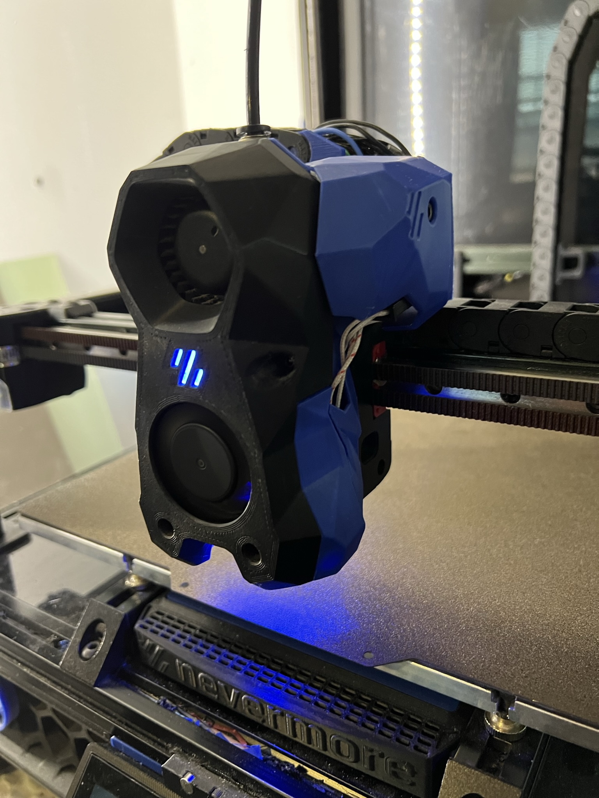
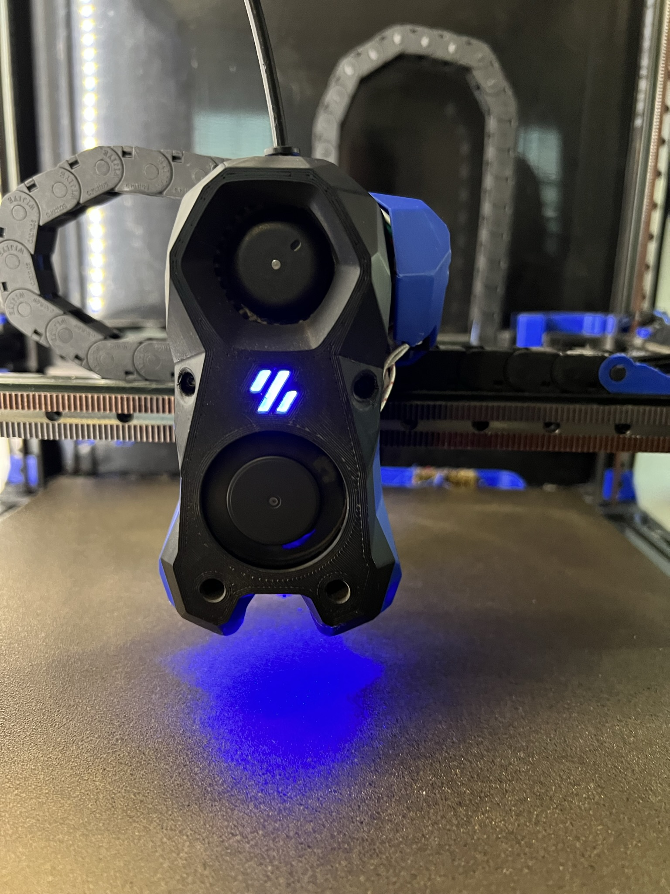

## Stealthburner + Clockwork Galileo 1 + PCB Cover

This is a cover for the Hartk PCB on a ClockWork Galileo 1 using a stealthBurner.  
It is a Remix of the [CW1 cover](https://github.com/VoronDesign/VoronUsers/tree/master/printer_mods/wile-e1/Stealthburner_CW1_PCB_Cover) made by Wily.
I tried the one created by Hartk but it did not work for me as it was hitting the Cable Chain Bridge when homing the X.

Please be sure to also use Hartks [Galileo body](https://github.com/hartk1213/MISC/tree/main/Voron%20Mods/Extruders/Galileo) with this as well as well as the correct [rear plate](https://github.com/VoronDesign/Voron-Hardware/blob/master/Afterburner_Toolhead_PCB/STLs/Galileo/motor_plate_galileo.stl).

